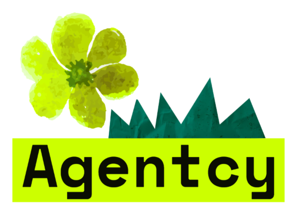

# Agentcy

<p align="center">
  
</p>

Agentcy is an open-source operations workspace for a marketing and creative agency. It turns inbound client conversations into visible, durable operational work: contextual support, internal routing, follow-up, and reporting.

> **MVP scope:** this is a single-agency deployment, not a multi-tenant SaaS product. Telegram is the live intake channel. The Discord operations workspace is provisioned and seeded through setup scripts; Meta adapters remain gated behind `ENABLE_META=false` until business verification is complete.

## Quick start (local development)

### Prerequisites

- Docker Engine and Docker Compose v2
- Git
- Python 3.11–3.12 only if running tests or local scripts outside Docker
- Node.js 20+ only if developing the frontend outside Docker

### 1. Clone and configure

```bash
git clone https://github.com/misterfesk/agentcy.git
cd agentcy
cp .env.example .env
python3 scripts/create_dev_secrets.py
```

`create_dev_secrets.py` generates local database and Redis secrets under `.secrets/` and creates an empty `.secrets/nebius_api_key` placeholder. Existing secret files are kept and their permissions are tightened to `0600`; nothing is overwritten. Everything under `.secrets/` is ignored by Git.

### 2. Add real channel and model credentials

Create these files with restrictive permissions:

```bash
printf '%s' 'YOUR_NEBIUS_API_KEY' > .secrets/nebius_api_key
printf '%s' 'YOUR_TELEGRAM_BOT_TOKEN' > .secrets/telegram_bot_token
chmod 600 .secrets/nebius_api_key .secrets/telegram_bot_token
```

Keep the following values in `.env` (already present in the example):

```dotenv
LLM_PROVIDER=nebius
NEBIUS_BASE_URL=https://api.tokenfactory.nebius.com/v1/
NEBIUS_MODEL=zai-org/GLM-5.3-Flash
NEBIUS_API_KEY_FILE=.secrets/nebius_api_key
```

Never put API keys or bot tokens in source code, commits, screenshots, or issue text.

### 3. Start the stack

```bash
docker compose up --build --detach --wait
```

This starts PostgreSQL, Redis, database migrations, the FastAPI app, the Telegram worker, the dashboard frontend, and Caddy. The local dashboard is served through Caddy at `http://localhost` when port 80 is available.

### 4. Check runtime health

```bash
docker compose ps
curl -fsS http://127.0.0.1:8000/health
curl -fsS http://127.0.0.1:8000/readyz
```

Expected responses:

```json
{"status":"ok"}
{"status":"ready"}
```

### 5. Seed a safe demo workspace (optional)

```bash
docker compose exec app python -m app.seed_mvp_demo
```

This creates clearly demo-oriented work items for the fictional agency context (Northstar Marketing, Mosaic Creative Studio). Replace it with real agency data before production use.

### 6. Test Telegram

Message the bot from any Telegram account. Try a multi-turn flow:

```text
What services do you offer for a hospitality launch?
We already have a brand but need paid media and content.
What would you need from us first?
```

Each message resolves to a durable client, identity, and thread before the support agent replies, and the reply is persisted after a successful send — follow-up messages continue the conversation instead of restarting it.

If the bot ever replies with the exact fallback "Thanks for reaching out to Agentcy. We have your message and will reply shortly.", the provider call failed or returned no customer-facing content; the worker intentionally falls back rather than pretending an AI answer was generated. Inspect the logs:

```bash
docker compose logs --tail=100 telegram-worker
```

## Discord workspace setup

The Discord operations workspace (channels, roles, demo content) is provisioned with scripts in `scripts/`; there is no runtime Discord bot worker yet (see [ARCHITECTURE.md](ARCHITECTURE.md) for the intended agent stack). Each script is idempotent, reads `DISCORD_BOT_TOKEN` and `DISCORD_HOME_CHANNEL` from the environment, and talks to the Discord API directly from local Python — install `discord.py` first (`pip install discord.py`).

1. Create the operations structure:

   ```bash
   DISCORD_BOT_TOKEN=... DISCORD_HOME_CHANNEL=... python3 scripts/provision_discord.py
   ```

   Creates the `AGENTCY OPERATIONS` category and its operational channels (command center, employee work, client escalations, approvals, agent activity, CEO briefings, ops alerts) idempotently.

2. Assign operational roles by immutable Discord user ID:

   Edit `ROLE_ASSIGNMENTS` in `scripts/assign_discord_roles.py`, then run it the same way. Map people by IDs, never by display names.

3. Seed and verify demo activity (optional):

   ```bash
   python3 scripts/post_discord_demo.py
   python3 scripts/verify_discord_demo.py
   ```

## What it does

- Accepts Telegram messages from anyone; the first message from a sender creates a client record (status `lead`) and a Telegram channel identity.
- Stores clients, channel identities, threads, inbound/outbound messages, todos, and agent runs in PostgreSQL.
- Routes new leads to customer support; clients with `active`, `paused`, or `churned` status route to the dedicated-account path.
- Uses Nebius Token Factory's OpenAI-compatible API with `zai-org/GLM-5.3-Flash` for customer-support replies, supplying the last 12 persisted messages so follow-ups continue in context.
- Persists the inbound message before any model call, and the outbound reply after a successful send.
- Deduplicates inbound events on `(channel, external_message_id)`.
- Serves a React operations dashboard through Caddy; it runs against labelled fixture data by default.
- Keeps Meta configuration in place but disabled; no Meta adapter code exists yet.

## Architecture

```text
Telegram (live intake)         Discord (script-provisioned workspace)
        │                               │
        ▼                               ▼
  telegram worker                provision / demo scripts
        │ persist inbound, then reply
        ▼
FastAPI application ───────────────► PostgreSQL
        │  /health, /readyz,           clients, identities, threads,
        │  /inbound/telegram           messages, todos, agent runs
        ├────────► Nebius / GLM-5.3-Flash
        │          contextual support response
        ▼
     Redis
  readiness probes, rate-limit utility
        │
        ▼
React dashboard ◄── Caddy reverse proxy
```

The Telegram worker never sends model output without first persisting the inbound message. After a successful send, it persists the outbound reply as well. The next response receives the last 12 persisted thread messages.

The dashboard ships in demo mode (`VITE_DATA_MODE=demo`): fixture data, clearly labelled, isolated from production. Setting `VITE_DATA_MODE=api` points its typed client at FastAPI `/api/v1`; today the backend serves `/health`, `/readyz`, and `POST /inbound/telegram`, so richer dashboard endpoints are not wired yet.

Read [ARCHITECTURE.md](ARCHITECTURE.md) for the intended agent stack and [DECISIONS.md](DECISIONS.md) for MVP trade-offs.

## What an agency needs to provide

Before deploying Agentcy for a real agency, gather these items:

1. **Agency profile**
   - agency name, website, location/time zone
   - services offered and concise service descriptions
   - approved tone of voice
   - FAQs, working hours, response expectations, escalation rules
   - any topics the agent must never answer autonomously: pricing, contracts, guarantees, timelines, legal claims, etc.

2. **Team and workflow map**
   - employees, roles, responsibilities, and stable Discord user IDs
   - which kinds of requests go to which role
   - who approves client-facing replies, scope changes, refunds, and commitments
   - daily digest recipients and reminder schedule

3. **Client and project data**
   - client names and lifecycle status: `lead`, `active`, `paused`, or `churned`
   - current projects, open tickets, key contacts, and approved history import
   - clear definition of when a lead becomes an active client

4. **Channel credentials**
   - Telegram bot token from BotFather
   - Discord application/bot token and guild ID
   - Nebius Token Factory API key
   - optionally later: Meta app secret, webhook verification token, access token, and the relevant WhatsApp/Instagram/Facebook IDs

5. **Deployment basics**
   - a Linux host with Docker Compose v2, a DNS name, and TLS-capable reverse proxy access
   - backups for the PostgreSQL volume
   - a private secrets-management process; do not commit credentials into Git

## Development and verification

```bash
python3 -m venv .venv
. .venv/bin/activate
pip install -e '.[dev]'
ruff check backend scripts
mypy backend/app
pytest -q
```

Frontend checks:

```bash
cd frontend
npm ci
npm run lint
npm run build
```

## Production checklist

- Use a stable domain and Caddy/another TLS reverse proxy; do not use a temporary tunnel as production infrastructure.
- Keep Postgres and Redis private to Docker/internal networks.
- Store all secrets outside Git and rotate any token ever exposed accidentally.
- Enable backups and periodically test restoring PostgreSQL data.
- Set practical auto-reply limits and escalation policies.
- Review model replies, provider failures, and agent activity before enabling automatic external actions.
- Map employees by immutable Discord IDs, not display names.
- Keep `ENABLE_META=false` until Meta verification and webhook signature checks are fully configured.

## Safety model

- Postgres is the durable system of record; inbound events are deduplicated.
- Every provider call is preceded by durable inbound persistence, and every successful send is followed by durable outbound persistence.
- The support agent receives only the system prompt, a routing note, and persisted conversation history — no raw SQL, channel credentials, or generic tools.
- The prompt forbids inventing prices, delivery dates, policies, guarantees, or client facts; replies are length-capped, and provider or parse failures return the safe fallback instead of a fabricated answer.
- Sensitive commitments require approval workflows; do not treat the MVP as an unattended autonomous sales or support system.

## License and contribution

This project is licensed under the MIT license (see [LICENSE](LICENSE)). It is being prepared as an open-source hackathon MVP. Contributions should include tests for any changed routing, provider, or channel behavior.
